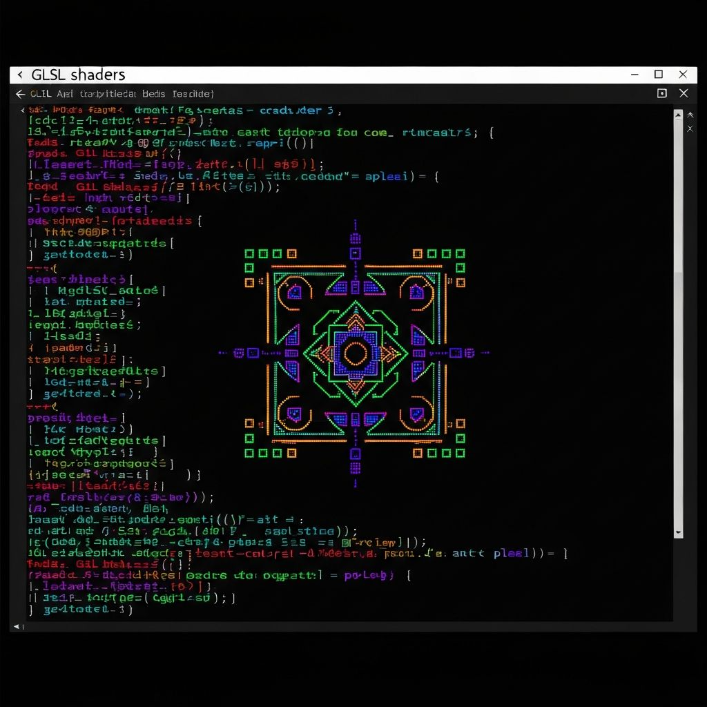

# Portfolio Philosoph

Cyberpunk-inspired personal portfolio built with Next.js.  
A living system of projects, gallery, blog, and a layered Archive with subcategory detail views.

       ██████╗██████╗  ██████╗ ██╗    ██╗
      ██╔════╝██╔══██╗██╔═══██╗██║    ██║
      ██║     ██████╔╝██║   ██║██║ █╗ ██║
      ██║     ██╔══██╗██║   ██║██║███╗██║
      ╚██████╗██║  ██║╚██████╔╝╚███╔███╔╝
       ╚═════╝╚═╝  ╚═╝ ╚═════╝  ╚══╝╚══╝ 



Cyberpunk Portfolio

## Highlights
- Terminal aesthetics with animated matrix backdrop
- Archive index + category + entry pages (`/archive/[slug]/[entry]`)
- Creative UI blocks: signal traces, ASCII scopes, pulse indicators
- Responsive hero with terminal on mobile and desktop

## Stack
- Next.js App Router
- React + TypeScript
- Tailwind CSS
- Vercel Analytics

## Key Routes
- `/` Home
- `/projects` Projects grid
- `/projects/[slug]` Project detail
- `/archive` Archive index
- `/archive/[slug]` Archive category
- `/archive/[slug]/[entry]` Archive entry
- `/gallery` Visual gallery
- `/blog` Blog list
- `/about` About layout

## Getting Started
```bash
npm install
npm run dev
```

Open `http://localhost:3000`.

## Structure
```
app/
  archive/
  blog/
  gallery/
  projects/
components/
  hero.tsx
  animated-terminal.tsx
  selected-work.tsx
```

## Notes
Most data is mocked in components and pages for layout prototyping and visual design.  
Replace the mock arrays with your data layer when ready.
