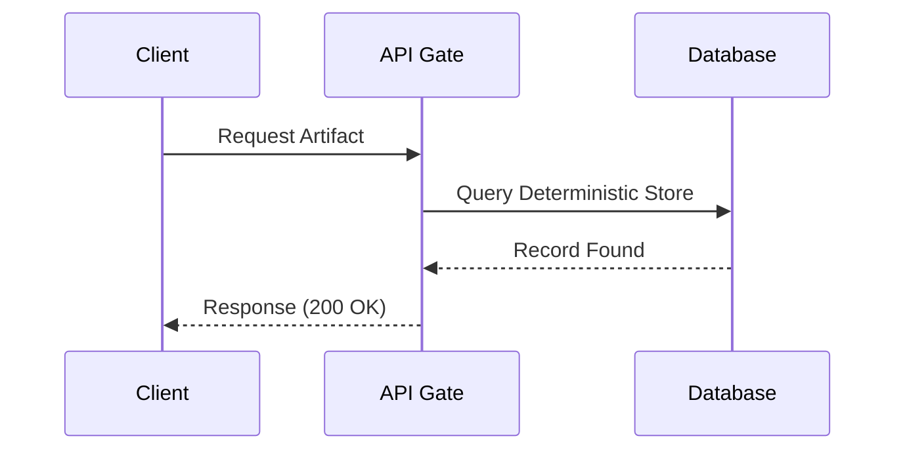

# Portfolio Project Report Generation Prompt

**Objective:** Act as a high-end Software Architect and Technical Writer to generate a detailed, premium-quality project report (`fullContent` field) for a software engineering portfolio. The content must be deep, technical, and written with an "Engineering-Philosophical" tone.

---

## 🏗️ Content Structure Requirements

1. **Title & Lead:** Start with a `# Title — Subtitle` format. The lead paragraph should be 2-3 sentences long, emphasizing the core value proposition and engineering philosophy.
2. **Horizontal Rules:** Use `---` for section transitions.
3. **Sections (`##`):** Use for major topics (e.g., Technology Stack, Architecture, System Flows, content orchestration).
4. **Sub-sections (`###` and `####`):** Use for technical deep-dives into specific features, patterns, or decisions.
5. **Images:** Include at least one image with a descriptive caption: ``.
6. **Alerts & Tips:** Use GitHub-style syntax within blockquotes to highlight critical insights:
   - `> [!TIP]` for optimizations.
   - `> [!IMPORTANT]` for core requirements.
   - `> [!CAUTION]` for risks/trade-offs.
7. **Mermaid Diagrams:** **Mandatory**. Include at least one `sequenceDiagram` or `flowchart TD` to visualize a complex system flow (e.g., auth, sync, data pipeline).
8. **Code Blocks:** Use syntax highlighting (e.g., `bash`, `typescript`, `rust`, `go`, `mermaid`).
9. **Directory Map:** Include a ` ```text ``` ` block showing the project's folder structure if applicable.
10. **Length:** Minimum 2500-3000 characters. The content must feel "dense" with technical substance.

---

## 🎭 Tone & Voice Guidelines

- **Professional & Premium:** Use sophisticated vocabulary (e.g., *orchestration, immutable, deterministic, resilience, latency, heuristics*).
- **Thematic Style (Optional but Recommended):** Following the "Memento Mori" project's style, use terms like "Artifacts" for data, "Rituals" for processes, and "The Void" or "Mortal Realm" for backend/frontend separation if it fits the project's identity.
- **Engineer-to-Engineer:** Focus on *why* decisions were made, not just *what* was built. Discuss trade-offs, scaling, and architectural decisions.

---

## 📝 Example Markdown Patterns to Use

### Sequence Diagram


### Alert Boxes
> [!IMPORTANT]
> **Deterministic Replay:** All event-driven handlers must be idempotent to ensure the system state remains consistent during recovery rituals.

### Deep-Dive Sections
#### 1. Transactional Integrity
Explain the complexity...

#### 2. Scaling Heuristics
Describe the performance...

---

## 🚀 The Task
Please take the following project metadata and generate the `fullContent` markdown field following all the rules above:

**Project Title:** [INSERT TITLE]
**Project Type:** [INSERT TYPE]
**Year:** [INSERT YEAR]
**Core Stack:** [INSERT STACK SEPARATED BY COMMAS]
**Key Metrics:** [INSERT METRICS]
**Primary Features:** [LIST MAIN FEATURES]
**Engineering Challenge:** [DESCRIBE A CORE TECH CHALLENGE SOLVED]
